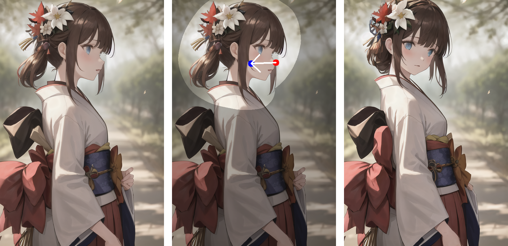
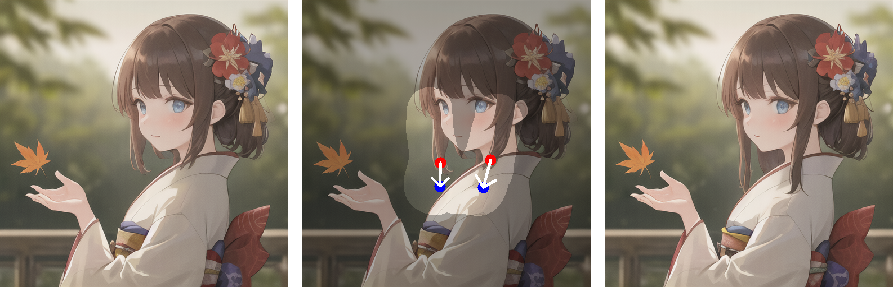
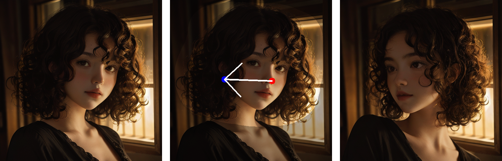

<p align="center">
  <h1 align="center">DragDiffusion: Harnessing Diffusion Models for Interactive Point-based Image Editing</h1>
  
  <br>
  <div align="center">
    
    
    
  </div>
  <div align="center">
    
  </div>
  
  <br>
</p>


## Installation

It is recommended to run our code on a Nvidia GPU with a linux system. We have not yet tested on other configurations. Currently, it requires around 14 GB GPU memory to run our method. We will continue to optimize memory efficiency

To install the required libraries, simply run the following command:
```
conda env create -f environment.yaml
conda activate dragdiff
```

## Run DragDiffusion
To start with, in command line, run the following to start the gradio user interface:
```
python3 drag_ui.py
```

You may check our [GIF above](https://github.com/Yujun-Shi/DragDiffusion/blob/main/release-doc/asset/github_video.gif) that demonstrate the usage of UI in a step-by-step manner.

Basically, it consists of the following steps:

### Case 1: Dragging Input Real Images
#### 1) train a LoRA
* Drop our input image into the left-most box.
* Input a prompt describing the image in the "prompt" field
* Click the "Train LoRA" button to train a LoRA given the input image

#### 2) do "drag" editing
* Draw a mask in the left-most box to specify the editable areas.
* Click handle and target points in the middle box. Also, you may reset all points by clicking "Undo point".
* Click the "Run" button to run our algorithm. Edited results will be displayed in the right-most box.

### Case 2: Dragging Diffusion-Generated Images
#### 1) generate an image
* Fill in the generation parameters (e.g., positive/negative prompt, parameters under Generation Config & FreeU Parameters).
* Click "Generate Image".

#### 2) do "drag" on the generated image
* Draw a mask in the left-most box to specify the editable areas
* Click handle points and target points in the middle box.
* Click the "Run" button to run our algorithm. Edited results will be displayed in the right-most box.


<!---
## Explanation for parameters in the user interface:
#### General Parameters
|Parameter|Explanation|
|-----|------|
|prompt|The prompt describing the user input image (This will be used to train the LoRA and conduct "drag" editing).|
|lora_path|The directory where the trained LoRA will be saved.|


#### Algorithm Parameters
These parameters are collapsed by default as we normally do not have to tune them. Here are the explanations:
* Base Model Config

|Parameter|Explanation|
|-----|------|
|Diffusion Model Path|The path to the diffusion models. By default we are using "runwayml/stable-diffusion-v1-5". We will add support for more models in the future.|
|VAE Choice|The Choice of VAE. Now there are two choices, one is "default", which will use the original VAE. Another choice is "stabilityai/sd-vae-ft-mse", which can improve results on images with human eyes and faces (see [explanation](https://stable-diffusion-art.com/how-to-use-vae/))|

* Drag Parameters

|Parameter|Explanation|
|-----|------|
|n_pix_step|Maximum number of steps of motion supervision. **Increase this if handle points have not been "dragged" to desired position.**|
|lam|The regularization coefficient controlling unmasked region stays unchanged. Increase this value if the unmasked region has changed more than what was desired (do not have to tune in most cases).|
|n_actual_inference_step|Number of DDIM inversion steps performed (do not have to tune in most cases).|

* LoRA Parameters

|Parameter|Explanation|
|-----|------|
|LoRA training steps|Number of LoRA training steps (do not have to tune in most cases).|
|LoRA learning rate|Learning rate of LoRA (do not have to tune in most cases)|
|LoRA rank|Rank of the LoRA (do not have to tune in most cases).|

--->


## Acknowledgement
This work is inspired by the amazing [DragGAN](https://vcai.mpi-inf.mpg.de/projects/DragGAN/).
The lora training code is modified from an [example](https://github.com/huggingface/diffusers/blob/v0.17.1/examples/dreambooth/train_dreambooth_lora.py) of diffusers. Image samples are collected from [unsplash](https://unsplash.com/), [pexels](https://www.pexels.com/zh-cn/), [pixabay](https://pixabay.com/). Finally, a huge shout-out to all the amazing open source diffusion models and libraries.

## Related Links
* [Drag Your GAN: Interactive Point-based Manipulation on the Generative Image Manifold](https://vcai.mpi-inf.mpg.de/projects/DragGAN/)
* [MasaCtrl: Tuning-free Mutual Self-Attention Control for Consistent Image Synthesis and Editing](https://ljzycmd.github.io/projects/MasaCtrl/)
* [Emergent Correspondence from Image Diffusion](https://diffusionfeatures.github.io/)
* [DragonDiffusion: Enabling Drag-style Manipulation on Diffusion Models](https://mc-e.github.io/project/DragonDiffusion/)
* [FreeDrag: Point Tracking is Not You Need for Interactive Point-based Image Editing](https://lin-chen.site/projects/freedrag/)

